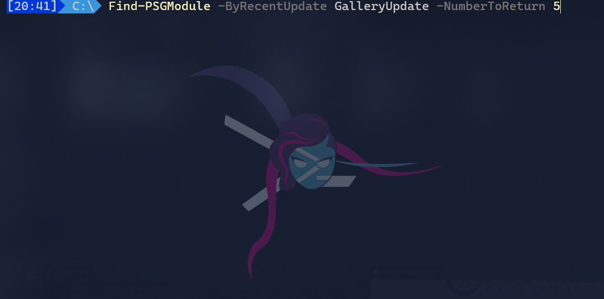

# PSGalleryExplorer

[](https://github.com/PowerShell/PowerShell) [![PowerShell Gallery][psgallery-img]][psgallery-site]  [![License][license-badge]](LICENSE) [](https://psgalleryexplorer.readthedocs.io/en/latest/?badge=latest)

[psgallery-img]:   https://img.shields.io/powershellgallery/dt/PSGalleryExplorer?label=Powershell%20Gallery&logo=powershell
[psgallery-site]:  https://www.powershellgallery.com/packages/PSGalleryExplorer
[psgallery-v1]:    https://www.powershellgallery.com/packages/PSGalleryExplorer/0.8.0
[license-badge]:   https://img.shields.io/github/license/techthoughts2/PSGalleryExplorer

<p align="center">
    
</p>

Branch | Windows | Windows pwsh | MacOS | Linux
--- | --- | --- | --- | --- |
main |  |  | [](https://ci.appveyor.com/project/techthoughts2/psgalleryexplorer/branch/main) |  |
Enhancements |  |  | [](https://ci.appveyor.com/project/techthoughts2/psgalleryexplorer/branch/Enhancements)|  |

## Synopsis

PSGalleryExplorer is a PowerShell module that extends the search functionality of the PowerShell Gallery by providing additional project information about modules. This enables you to search, explore, and discover PowerShell Gallery modules based on additional criteria.



## Description

PSGalleryExplorer is a PowerShell module that extends the search functionality of the PowerShell Gallery by providing additional project information about modules. It enables users to search, explore, and discover PowerShell Gallery modules based on additional criteria that are not available via `Find-Module`. The module provides various features such as filtering results based on download counts, stars, forks, and repository health metrics like open issues, license, and last updated date. With PSGalleryExplorer, users can easily identify trending and actively developed modules, and explore module repositories directly from the console.

### Features

- Fully cross-platform and can be run on Windows, Linux, and macOS
- Discover modules based on various criteria such as number of downloads, stars, forks, and more
- Get insights into the community health of a module's repository, including information about open issues, license, and last updated date
- Identify modules that are actively being developed by filtering based on their most recent repository update date.
- Compliments existing tools like `Find-Module` to provide another way to explore modules on the PowerShell Gallery.
- Identify up-and-coming or trending modules by comparing search results including and excluding popular and corporate modules
- PSGalleryExplorer provides a detailed, informative output of module results to help you quickly identify prime candidates for further exploration.

## Getting Started

### Documentation

Documentation for PSGalleryExplorer is available at: [https://psgalleryexplorer.readthedocs.io](https://psgalleryexplorer.readthedocs.io)

### Installation

```powershell
# Install PSGalleryExplorer from the PowerShell Gallery
Install-Module -Name "PSGalleryExplorer" -Repository PSGallery -Scope CurrentUser
```

### Quick start

```powershell
#------------------------------------------------------------------------------------------------
# import the PSGalleryExplorer module
Import-Module -Name "PSGalleryExplorer"
#------------------------------------------------------------------------------------------------
# discover module info by tag
Find-PSGModule -ByTag Telegram
#------------------------------------------------------------------------------------------------
# discover PowerShell modules by # of Gallery Downloads
Find-PSGModule -ByDownloads
#------------------------------------------------------------------------------------------------
# discover the most recently updated modules on repo
Find-PSGModule -ByRecentUpdate RepoUpdate
#------------------------------------------------------------------------------------------------
# discover the most recently updated modules on the PowerShell Gallery
Find-PSGModule -ByRecentUpdate GalleryUpdate
#------------------------------------------------------------------------------------------------
# discover PowerShell modules by # of Gallery Downloads
# include corporate modules and common/popular modules in results
# return top 50
Find-PSGModule -ByDownloads -IncludeCorps -IncludeRegulars -NumberToReturn 50
#------------------------------------------------------------------------------------------------
# discover PowerShell modules by # of repo project stars
Find-PSGModule -ByRepoInfo StarCount
#------------------------------------------------------------------------------------------------
# discover PowerShell modules that could possibly use some help
Find-PSGModule -ByRepoInfo Issues
#------------------------------------------------------------------------------------------------
# discover PowerShell modules by # of repo project subscribers
Find-PSGModule -ByRepoInfo Subscribers
#------------------------------------------------------------------------------------------------
# discover a set of random modules
Find-PSGModule -ByRandom
#------------------------------------------------------------------------------------------------
# discover module info by name
Find-PSGModule -ByName 'PoshGram'
#------------------------------------------------------------------------------------------------
```

## Notes

This PowerShell project was created with [Catesta](https://github.com/techthoughts2/Catesta).

## Contributing

If you'd like to contribute to PSGalleryExplorer, please see the [contribution guidelines](.github/CONTRIBUTING.md).

## License

This project is [licensed under the MIT License](LICENSE).
