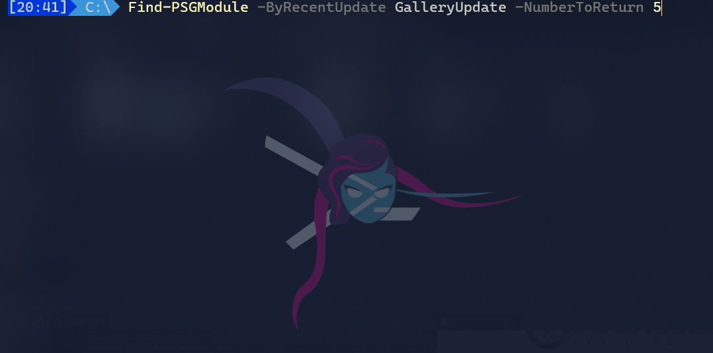

# PSGalleryExplorer

[](https://github.com/PowerShell/PowerShell)
[![PowerShell Gallery][psgallery-img]][psgallery-site]


[psgallery-img]:   https://img.shields.io/powershellgallery/dt/PSGalleryExplorer.svg
[psgallery-site]:  https://www.powershellgallery.com/packages/PSGalleryExplorer
[psgallery-v1]:    https://www.powershellgallery.com/packages/PSGalleryExplorer/0.8.0

<p align="center">
    
</p>

Branch | Windows | Windows pwsh | MacOS | Linux
--- | --- | --- | --- | --- |
master |  |  | [](https://ci.appveyor.com/project/techthoughts2/psgalleryexplorer/branch/master) |  |
Enhancements |  |  | [](https://ci.appveyor.com/project/techthoughts2/psgalleryexplorer/branch/Enhancements)|  |

## Synopsis

PSGalleryExplorer is a PowerShell module that lets you search, explore, and discover PowerShell Gallery modules based on various criteria.



## Description

PSGalleryExplorer extends PowerShell Gallery Module search functionality by including information about a module's associated repository.

There are a variety of search options that aim to search and explore the available modules on the PowerShell Gallery.

To aid in module discovery more common/popular modules and modules made by corporations are excluded by default. Popular modules and corporation modules can be included in results by specifying the necessary parameter switches.

[PSGalleryExplorer](docs/PSGalleryExplorer.md) provides the following functions:

* [Find-PSGModule](docs/Find-PSGModule.md)

## Why

To aid in the discoverability of modules in the PowerShell Gallery.

The current PowerShell Gallery search options are primarily limited to module name, and tags. CI/CD processes also inflate the download numbers of many modules on the gallery. This makes it challenging to get a sense of new and trending modules that the community is using.

This project aims to increase the discoverability of modules on the PowerShell Gallery and encourage module exploration.

## Installation

### Prerequisites

* [PowerShell 5.1](https://github.com/PowerShell/PowerShell) *(or higher version)*

### Installing PSGalleryExplorer via PowerShell Gallery

```powershell
#from a 5.1+ PowerShell session
Install-Module -Name "PSGalleryExplorer" -Scope CurrentUser
```

## Quick start

```powershell
#------------------------------------------------------------------------------------------------
# import the PSGalleryExplorer module
Import-Module -Name "PSGalleryExplorer"
#------------------------------------------------------------------------------------------------
# discover PowerShell modules by # of Gallery Downloads
Find-PSGModule -ByDownloads
#------------------------------------------------------------------------------------------------
# discover PowerShell modules by # of Gallery Downloads
# include corporate modules and common/popular modules in results
# return top 50
Find-PSGModule -ByDownloads -IncludeCorps -IncludeRegulars -NumberToReturn 50
#------------------------------------------------------------------------------------------------
# discover PowerShell modules by # of repo project stars
Find-PSGModule -ByRepoInfo StarCount
#------------------------------------------------------------------------------------------------
# discover PowerShell modules that could possibly use some help
Find-PSGModule -ByRepoInfo Issues
#------------------------------------------------------------------------------------------------
# discover PowerShell modules by # of repo project subscribers
Find-PSGModule -ByRepoInfo Subscribers
#------------------------------------------------------------------------------------------------
# discover the most recently updated modules on the PowerShell Gallery
Find-PSGModule -ByRecentUpdate GalleryUpdate
#------------------------------------------------------------------------------------------------
# discover the most recently updated modules on repo
Find-PSGModule -ByRecentUpdate RepoUpdate
#------------------------------------------------------------------------------------------------
# discover a set of random modules
Find-PSGModule -ByRandom
#------------------------------------------------------------------------------------------------
# discover module info by name
Find-PSGModule -ByName 'PoshGram'
#------------------------------------------------------------------------------------------------
# discover module info by tag
Find-PSGModule -ByTag Telegram
#------------------------------------------------------------------------------------------------
```

## Author

[Jake Morrison](https://twitter.com/JakeMorrison) - [https://techthoughts.info/](https://techthoughts.info/)

## Notes

Repo information is provided via a [PowerShell Serverless Solution](docs/PowerShell_Serverless.md)

This PowerShell project was created with [Catesta](https://github.com/techthoughts2/Catesta).

## FAQ

[PSGalleryExplorer - FAQ](docs/PSGalleryExplorer-FAQ.md)

## License

This project is [licensed under the MIT License](LICENSE).

## Changelog

Reference the [Changelog](.github/CHANGELOG.md)
