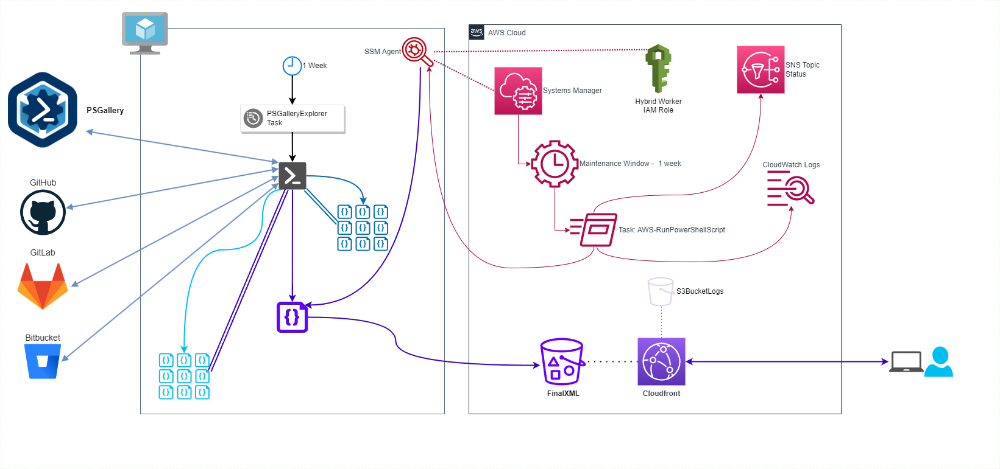

# PSGalleryExplorer - Data Component

## Overview

One key feature of PSGalleryExplorer is the inclusion of associated repository information for each module.

For several years PSGalleryExplorer leveraged a [PowerShell serverless model](assets/Serverless_PowerShell_DataPull.png) for data collection. However, as the number of modules continued to grow, this was unable to process the data set in a time efficient manner.

Today, a fully PowerShell hybrid solution is deployed to continually collect and update repository information for PSGalleryExplorer's use.

## Deployment Stack

- [Cloudformation for Serverless deployment](../CloudFormation/PSGalleryExplorer/)

## Design Diagram

## Outline

1. A Hybrid worker configured via [AWS Systems Manager](https://aws.amazon.com/systems-manager/) is configured with a weekly scheduled task.
    - This task:
        - Downloads all current modules from the PSGallery
        - Identifies modules that have public repositories
        - Queries [GitHub](https://github.com/), [GitLab](https://gitlab.com), and [Bitbucket](https://bitbucket.org) to retrieve project information
        - Combines data sets together to one final data set.
1. An [AWS Systems Manager Maintenance Window](https://docs.aws.amazon.com/systems-manager/latest/userguide/systems-manager-maintenance.html) task is set up to retrieve the data set and publish it to [Amazon CloudFront](https://aws.amazon.com/cloudfront/)
1. Users of PSGalleryExplorer can quickly download the refreshed data set worldwide when running searches

You can see additional metric data of data cache age, and cache downloads on the [PSGalleryExplorer Metrics](PSGalleryExplorer-Metrics.md) page.
