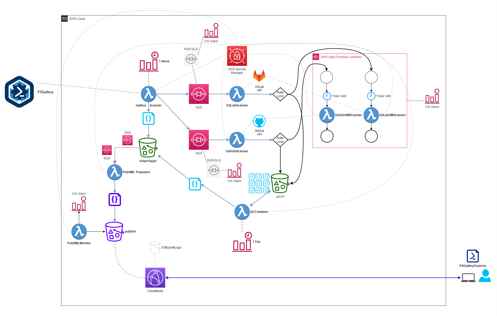

# PSGalleryExplorer - Serverless Component

## Synopsis

PSGalleryExplorer includes a modules corresponding GitHub project information when returning module results.

A fully PowerShell serverless solution is deployed to continually collect and update GitHub information for PSGalleryExplorer's use.

## Deployment Stack

* [Cloudformation for Serverless deployment](../CloudFormation/PSGE.yml)
* [PowerShell Lambdas used](../PSLambda/)

## Serverless Design Diagram

## Outline

1. [Cloud Watch Event](https://docs.aws.amazon.com/AmazonCloudWatch/latest/events/WhatIsCloudWatchEvents.html) triggers **GalleryScanner** [lambda](https://aws.amazon.com/lambda/) once per week.
    * Retrieves all module information from [PowerShell Gallery](https://www.powershellgallery.com/)
      * Saves module info to **stagetrigger** in XML format using [Convert](https://github.com/austoonz/Convert)
    * For each module found an [SQS](https://aws.amazon.com/sqs/) message is sent containing relevant module information.
1. **GitHubScanner** [lambda](https://aws.amazon.com/lambda/) picks up [SQS](https://aws.amazon.com/sqs/) messages in batches of 10.
    * Retrieves the Github Oauth token from [AWS Secrets Manager](https://aws.amazon.com/secrets-manager/).
    * Queries [GitHub API](https://developer.github.com/v3/) for module project information.
      * If GitHub API rate limit is exceeded - triggers [step function](https://aws.amazon.com/step-functions/) to delay hitting API by 1 hour.
    * Saves GitHub information in XML format using [Convert](https://github.com/austoonz/Convert) to **gitxml**.
1. [Cloud Watch Event](https://docs.aws.amazon.com/AmazonCloudWatch/latest/events/WhatIsCloudWatchEvents.html) triggers **GCCombine** [lambda](https://aws.amazon.com/lambda/) once per day.
    * Downloads all xml files from **gitxml** and merges into memory.
    * Diffs the combined data set with consolidated file in **stagetrigger**.
    * Saves final combined data set to **stagetrigger** if diff detected.
1. **stagetrigger** is configured with an [S3 Event](https://docs.aws.amazon.com/AmazonS3/latest/dev/NotificationHowTo.html) that is tied to a [SQS](https://aws.amazon.com/sqs/). This triggers **PubXMLPopulator** [lambda](https://aws.amazon.com/lambda/) whenever a change is made to the bucket.
    * Combines PowerShell Gallery XML and GitHub XML data into a single XML data set and saves to **pubxml**
1. PSGalleryExplorer utilizes the finale XML data set.
